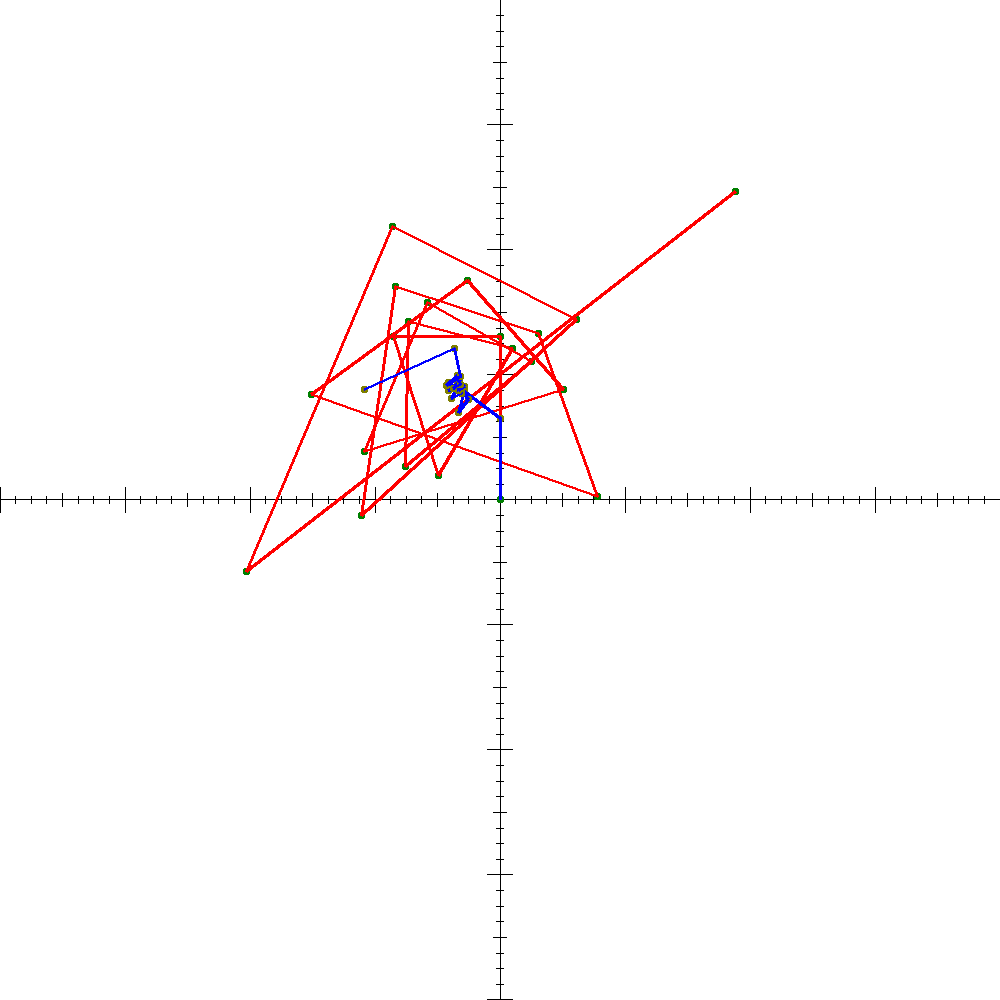
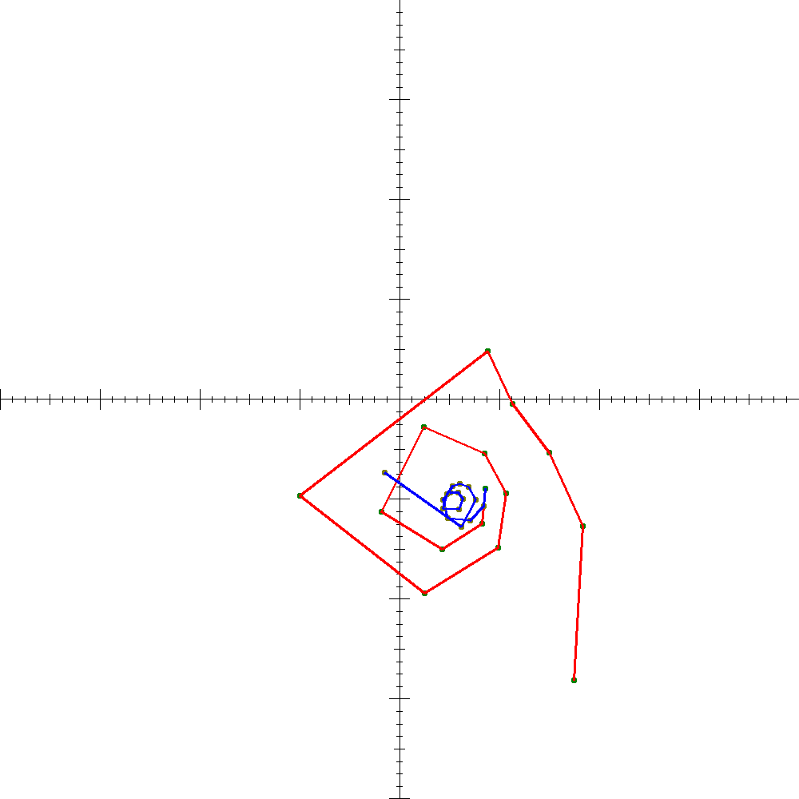
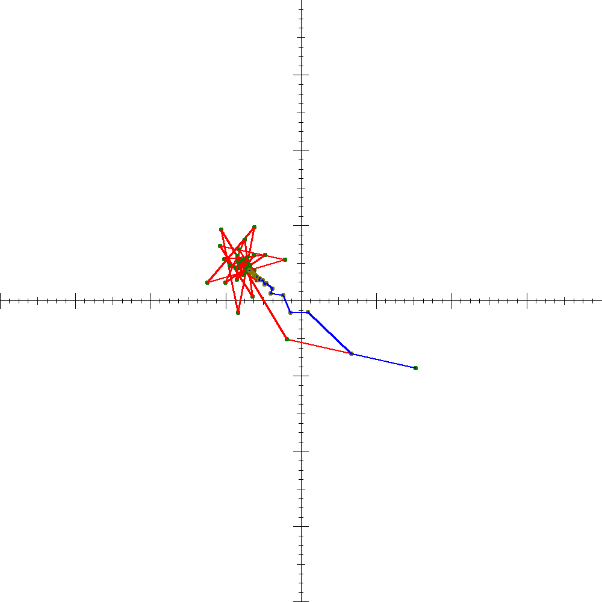
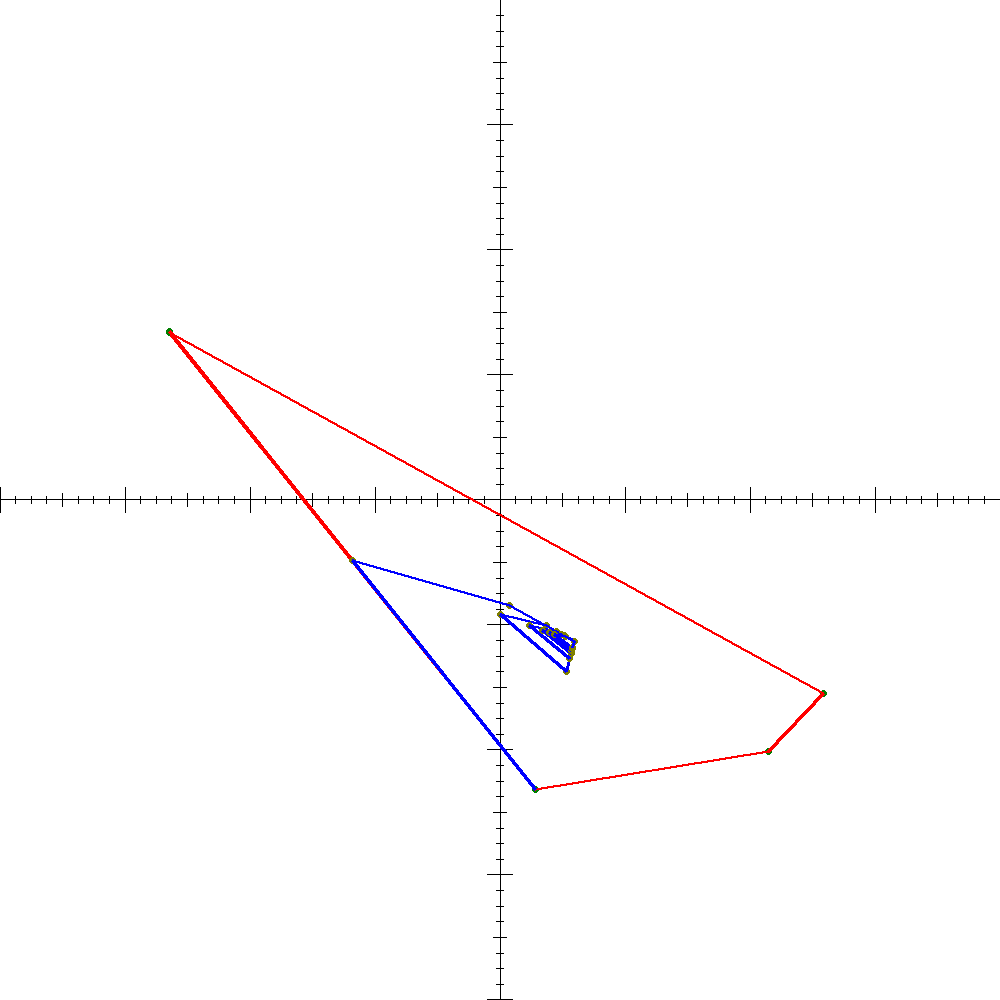

# Julia-Orbit
The program is written in Python and was coded in collaboration with Jérôme Côté during the summer of 2021.

## How to use the program
To use the program, you compile it in the command line using the command: python trajectoireOrbite-GUI.py. The slider controls the real and imaginary parts of z and the real and imaginary part of c in the complex-valued function z^2 + c.

## Explaination of the output
The output of the program is a diagram illustrating the orbit of z^2 + c under a certain number of iterations. The polygonal line in red and the green dots represent the orbit of sequence z_{n+1} = z_n^2 + c. The polygonal line in blue represents the averages of z_1, z_2, ..., z_n. See the picture below.

## Research goals
The goal of this project was to study summability methods and its application to the generation of Julia sets and the Mandelbrot set.

